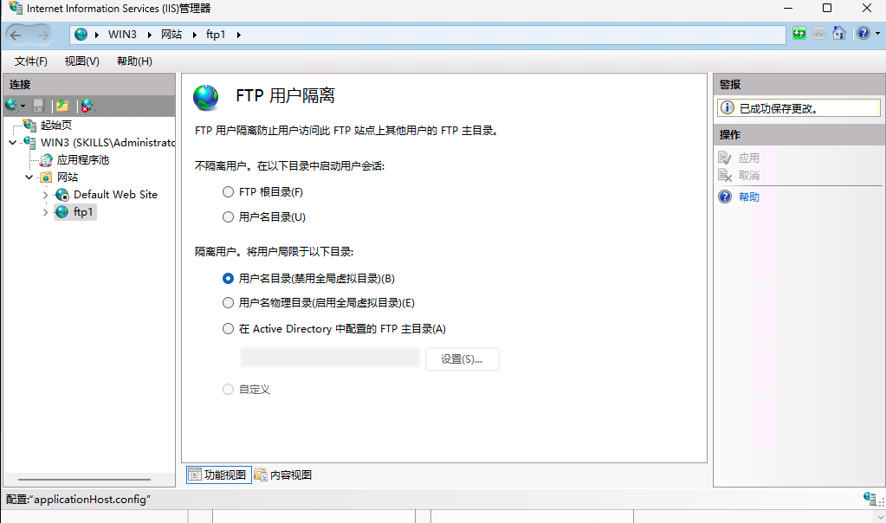

## 题目
- 安装FTP服务，新建一个FTP站点，并建立用户soft1、soft2，密码均为ftp123。
- FTP站点主目录为C:\ftproot，通过适当技术实现用户soft1与soft2通过匿名方式登录FTP站点时，只能浏览到“Public”子目录内容，若用个人账号登录FTP站点，则只能访问与用户名同名的自己的子文件夹。

## 解
- 创建主目录，目录结构如下
```powershell
C:\ftproot>tree
文件夹 PATH 列表
卷序列号为 F64D-FEA0
C:.
├─localuser
│  └─Public
└─skills
    ├─soft1
    └─soft2
```

- 创建ftp站点
- 配置FTP用户隔离如下图

